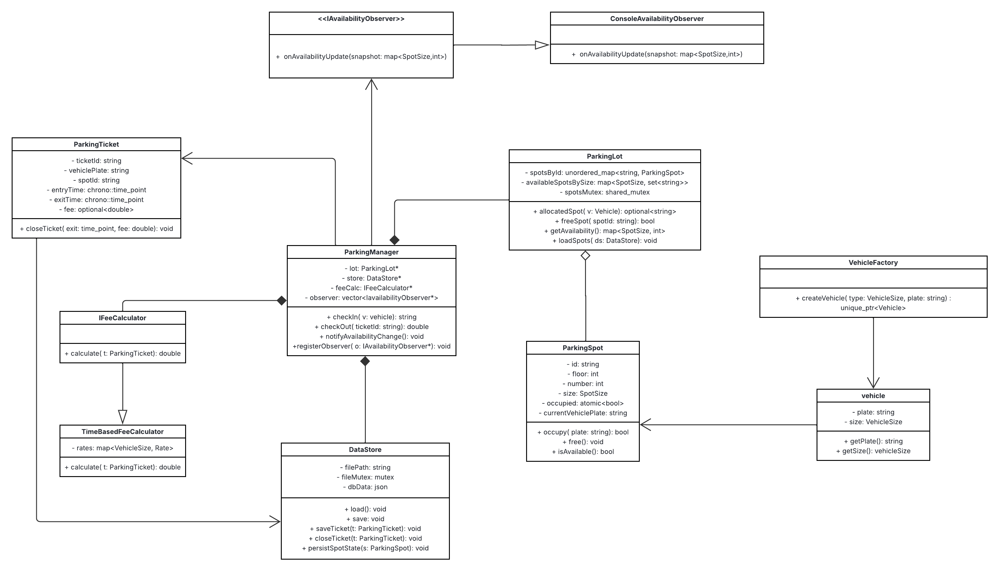

# Solution

Breif Solution of the SmartParkingLot

## UML Diagram

## Core Entities (from the UML)

| **Entity / Class** | **Description** |
|---------------------|-----------------|
| **ParkingManager** | Acts as the *facade/service layer* that orchestrates all major operations — including vehicle check-in/check-out, parking spot allocation, fee calculation, data persistence, and broadcasting availability updates to observers. |
| **ParkingLot** | Represents the *in-memory model* of the parking area’s structure and current availability status. Maintains mapping of spot types and their states. |
| **ParkingSpot** | Models an *individual parking space* with attributes like ID, size, and occupancy state (occupied/free). Handles the association with a vehicle temporarily. |
| **ParkingTicket** | Represents a *transaction record* for each vehicle’s stay — stores details like vehicle plate, spot ID, check-in/out times, and computed fees. |
| **Vehicle** | Simple data object containing *vehicle attributes* such as plate number and size category (e.g., Motorcycle, Car, Bus). |
| **VehicleFactory** | A *factory class* responsible for creating and validating `Vehicle` instances. Centralizes construction logic and ensures correct vehicle size mappings. |
| **IFeeCalculator / TimeBasedFeeCalculator** | Defines the *strategy interface* for fee calculation and a *concrete implementation* based on parking duration and vehicle size. Enables flexible pricing logic without changing core logic. |
| **AvailabilityObserver / ConsoleAvailabilityObserver** | Implements the *Observer pattern* — observers receive live updates about parking lot availability. The `ConsoleAvailabilityObserver` logs updates for debugging or demonstration purposes. |
| **DataStore** | Acts as the *persistence layer*, handling the saving and retrieval of `ParkingTicket` and `ParkingSpot` data for long-term storage and recovery. |

## Relationship Map (From → To)

This section describes how each class in the **Smart Parking System** is related to others — including the type of relationship, multiplicity, and the reasoning behind each connection.

| **From** | **To** | **Relationship** | **Multiplicity** | **Direction** | **Why this relationship** |
|-----------|---------|------------------|------------------|----------------|-----------------------------|
| **ParkingManager** | **ParkingLot** | Aggregation / “has-a” | 1 → 1 | Manager → Lot | Manager needs a single lot to allocate/free spots and query availability. Aggregation keeps them separate lifecycles but logically owned by the manager. |
| **ParkingManager** | **DataStore** | Aggregation / “has-a” | 1 → 1 | Manager → Store | Manager persists/loads tickets and spot snapshots. Kept as a dependency for testability and substitution. |
| **ParkingManager** | **IFeeCalculator** | Strategy (aggregation) | 1 → 1 | Manager → IFeeCalculator | Manager delegates fee logic to a pluggable calculator. Allows different pricing policies without changing orchestrator code. |
| **ParkingManager** | **AvailabilityObserver** | Observer (subject→observers) | 1 → * | Manager → Observers | Manager emits availability snapshots (register/notify). Multiple observers can subscribe (console, dashboards, webhooks). |
| **ParkingManager** | **ParkingTicket** | Association (creates/updates) | * | Manager → Ticket | Manager creates open tickets at check-in and closes them at check-out. Tickets are data records, not “owned objects.” |
| **ParkingLot** | **ParkingSpot** | Composition | 1 → * | Lot → Spots | Spots exist only within a lot’s topology. If the lot is discarded, the spots are meaningless—hence composition. |
| **ParkingLot** | **ParkingSpot** | Operational association (runtime) | Lot ↔ Spot | — | The lot allocates/frees spots and maintains availability indices (`availableSpotsBySize`). |
| **ParkingSpot** | **Vehicle (plate)** | Association via data | 0/1 per spot | Spot → Vehicle plate (string) | Spot holds `currentVehiclePlate` only for operational checks; the authoritative relation lives in `ParkingTicket`. |
| **ParkingTicket** | **ParkingSpot** | Association (by spotId) | 1 → 1 | Ticket → Spot | Each ticket records the spot used during the stay (via `spotId`). |
| **ParkingTicket** | **Vehicle** | Association (by vehiclePlate + vehicleSize) | 1 → 1 | Ticket → Vehicle (snapshot) | Ticket captures plate and size at check-in for audit and pricing. |
| **VehicleFactory** | **Vehicle** | Factory (creation) | 1 → * | Factory → Vehicle | Encapsulates object creation and validation for vehicles. |
| **TimeBasedFeeCalculator** | **IFeeCalculator** | Realization (implements) | 1 → 1 | Concrete → Interface | A concrete strategy that calculates fee by duration and size. |
| **ConsoleAvailabilityObserver** | **AvailabilityObserver** | Realization (implements) | 1 → 1 | Concrete → Interface | Simple sink that prints snapshots for demos/ops. |
| **DataStore** | **ParkingTicket** | Association (persist/update) | * | Store ↔ Ticket | Saves/loads tickets; updates on close. |
| **DataStore** | **ParkingSpot** | Association (persist state) | * | Store ↔ Spot | Persists spot states (optional snapshots) for recovery. |

### Key Notes
- **Aggregation ( kite without colour )** → “Has-a” relationship; objects can exist independently.  
- **Composition (kite with colour filled )** → Strong ownership; if the container dies, contained objects die.  
- **Association (→)** → Reference or linkage without ownership.  
- **Realization (⇢)** → Implements an interface.